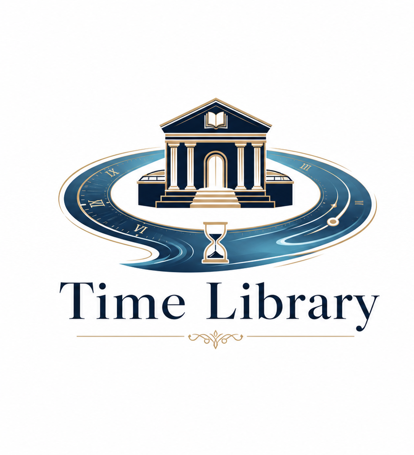

# Time Library

<p align="center">
  
</p>

<p align="center">
  <strong>The local memory layer for AI agents — with the receipts.</strong>
</p>

<p align="center">
  Other memory tools make an AI remember a <em>summary</em>. Time Library makes it remember the <em>original source</em>, remember <em>when</em> it was true, and prove it was actually <em>used</em> — and it lets several agents on one machine read the same memory, so you stop relaying context by hand.
</p>

<p align="center">
  <a href="README.zh-CN.md">简体中文</a> ·
  <a href="https://github.com/strmforge/time-library/releases/tag/v2026.7.10">2026.7.10</a> ·
  <a href="LICENSE">MIT</a>
</p>

<p align="center">
  
  
  
</p>

**Time Library / 时间图书馆** is the product name.

Time Library is easiest to understand as a five-step local workflow:

```text
capture -> recall -> answer from evidence -> install agent rule -> health
```

It is not a hosted chat app and not a summary-to-vector API. It keeps original
records on your machine, returns source refs before raw excerpts, and gives
local agents a standing rule for when to check memory before they answer or act.

## Why Time Library (not just another memory store)

Three things most memory tools don't do:

- **Source-provenance, not paraphrase.** Every remembered card traces back to the byte offset of the original words. Summaries are navigation; the raw record is the authority. Not "I think I remember" — "here's the original, at this line."
- **It *is* time.** As-of queries, time travel, and a raw → daily → digest sediment are its nature, not a feature bolted on. You can ask what the system believed on a given day. That is why it is a *library of time*.
- **Many agents, one low-noise pool — no human relay.** On one machine, Codex / Claude / OpenClaw / Hermes read a shared, read-only, traceable project memory. It hands out a *catalog* (a map), not a dump into your window, so recall stays low-contamination — and you stop being the middleman who repeats context between tools.

**Why not just use Cognee (or Mem0)?** They store summaries. Time Library stores the original source, the time, and proof it was delivered and used — and multiple agents share one pool. Provenance is not decoration: in ablation, removing the two-layer / source path costs 13.31 points.

## Core Workflow

- **Capture source records**: keep original conversations, tool output, source tool, device, and timeline before any summary. Summaries help navigation, but original records remain the source of truth.
- **Recall with source refs**: ask about old decisions, preferences, fixes, project boundaries, or next steps and get compact source refs, library ids, hit reasons, and optional bounded excerpts.
- **Answer from evidence**: when a model is configured, Time Library can ask it to answer only from supplied evidence, cite supporting refs, or return `UNKNOWN` when evidence is insufficient.
- **Install an agent rule**: add the Time Library skill/instruction or `time-library` MCP tool so Codex, Claude, OpenClaw, Hermes, Cursor-style tools, and other local agents know when to call recall.
- **Check health before trust**: use capability check, Record Doctor, and preflight doctor so install checks, daily recall, and troubleshooting do not blur together.

## Advanced Capabilities

- **Shared local context**: use one local record base across Claude Desktop, Claude Code CLI, Codex, OpenClaw, Hermes, Cursor-style tools, and popular open-source agents.
- **Preference and work-experience shelves**: The preference shelf keeps preference and intent experience; The work-experience shelf keeps work experience, validation paths, gotchas, and repair order. Experience is not a skill library.
- **Experience for every local agent**: deliver source-backed work experience through skills, custom instructions, MCP, and `work_preflight` so agents can check work history before acting.
- **Hermes skill evolution**: compare Hermes skills with work-experience records in a read-only diff, then turn new skills or changed skills into reviewable adoption or upgrade candidates.
- **Safe agent authority**: memory is passive by default. Recall context cannot silently become a direct answer, and a direct answer cannot silently become a platform action.
- **Local console**: open a browser page to see tools detected on this machine, recent record health, safe capability checks, and where new raw records are stored.
- **Local diagnostics**: keep health checks, record checks, and troubleshooting reports separate from the daily recall path.
- **Simple install options**: use one shell command, PowerShell, or the double-click installers included in the release zip.

## Reading Room and Whiteboard

The reading room is a shared workspace for several agents on one machine; the whiteboard inside it is the project progress board. Project state, in-flight tasks, and review boundaries live on one picture, so a new agent can see where a project actually stands instead of asking you.

## Delivered and Used, Not Just Stored

Having a card in the library is not the same as an agent seeing it. Time Library records delivery — was it surfaced to the agent? — and keeps borrow / return notes — was it useful, useless, or misleading? — that feed the next experience candidate. Most tools prove storage; Time Library aims to prove the store → use loop.

## Hermes: Autonomous Experience Upgrade

When Hermes is connected, new raw can automatically trigger Hermes to generate or upgrade a skill; Time Library observes that skill and abstracts it into a source-backed *experience candidate*, then backs off by value — no new raw means no spend. This autonomous chain has been proven end to end: the skill is written by Hermes itself, not by a human. It runs as a value-gated background agent registered with the OS scheduler: it wakes hourly but only triggers when new raw is due, with a 24-hour minimum interval and a one-run-per-day budget, so it stays bounded and never burns idle cycles. Adoption into production experience remains a separate, closed gate.

## Quick Demo

After install, open the local console:

```text
http://127.0.0.1:9850
```

Then run the safe first check:

```json
{"query":"capability check","mode":"capability_check"}
```

A healthy first result says the connection is read-only, no real memory was recalled, and no raw excerpt was returned. After that, try a real question such as:

```text
What did we decide last time about this project?
```

Time Library is designed to answer with source refs first, then expand to original evidence only when you ask.

Before asking an agent to change code, install, sync, or troubleshoot, ask it to
check local context first. The expected behavior is simple: tell you whether the
work looks already built, miswired, missing a diagnostic, or truly missing, then
inspect the repo and tools before editing.

## What It Remembers

AI tools forget the small things that make work smooth: your preferred wording, project boundaries, old mistakes, useful fixes, and where a task left off. Time Library keeps that trail on your own machine so a new agent window does not have to start from zero.

It is not a hosted chat app and not a summary vault. It keeps source records, source refs, corrections, and work experience together so memory can point back to the original words.

## How Experience Evolves

Experience evolves, but it is not a black box. Time Library supports
evidence-backed curation with validation and receipts. Experience moves like a
library curation workflow:

```text
raw record
-> experience candidate
-> review queue
-> source and acceptance-check validation
-> authorized adoption or rejection
-> rollback, supersede, or upgrade receipt
```

That means a useful repair path can become reusable work experience, while a
bad or unsupported lesson can stay in review, move to errata, or be rolled back.
The current system supports curated evolution; it does not claim fully
autonomous self-training.

## What You Get In Practice

- **Shared local context for your AI tools**: Claude Desktop, Claude Code CLI, Codex, OpenClaw, Hermes, Cursor-style tools, and fast-moving open-source agents can connect to the same local record base.
- **Working methods that survive the next window**: preferences stay available, while proven ways of working become reusable guidance.
- **Preferences and experience stay distinct**: the preference layer keeps preferences, corrections, and boundaries; the work-experience layer keeps repair paths, validation steps, and work methods.
- **Experience can intervene across platforms**: work experience is not private to one tool. Any local agent with a skill, custom instruction, or MCP entry can read the same experience candidates, gotchas, and acceptance checks before work.
- **Fewer repeated fixes**: before starting work, an agent can check whether you already built the feature, tested the path, or found the same wiring problem earlier.
- **Receipts, not vibes**: remembered items keep source trails so you can check why something came back.
- **Original records stay original**: summaries can help navigation, but they do not replace saved source text.
- **Tool boundaries stay visible**: Claude Desktop and Claude Code CLI are treated separately; relay or official-login records are not silently mixed.
- **A safer first test**: capability check proves the local read-only path works without recalling real memory or returning raw excerpts.
- **Install once, then it finds your tools**: Time Library discovers local AI tools, including popular open-source agents such as OpenCode, Goose, Aider, and OpenHands, connects usable local AI tool entries, and keeps new memory sources in a computer-first archive.
- **Smarter recognition for new tools**: if you have a model configured, or already have a local AI model setting Time Library can reuse, it can identify unfamiliar tools from metadata only; if not, local rules still work.

## Paste This To Your Local Agent

If you use Codex, Claude Code CLI, OpenClaw, Hermes, or another local agent that can run terminal commands, paste this prompt into it:

```text
You are installing Time Library for me on this machine.
Repository: https://github.com/strmforge/time-library

First check whether Time Library is already installed and running on this machine. Probe `http://127.0.0.1:9851` and any local install marker you know how to inspect. If it is already installed and reachable, do not reinstall it. In that case, only connect this platform's native delivery surface and MCP. If it is not installed, install and start Time Library.

Then install Time Library as a standing memory rule for this agent, not just a one-time setup note. If this platform supports skills or custom instructions, add the Time Library skill/instruction. If this platform supports MCP, register the MCP tool named time-library at http://127.0.0.1:9851/mcp. If this platform is Claude Code, also install the UserPromptSubmit hook that calls the local Time Library preflight path; that hook must stay quiet and never block prompts when 9851 is unavailable.

After setup, run only a safe capability check with time_library_recall:
{"query":"capability check","mode":"capability_check"}
Do not recall my real memory yet; do not recall my real memory until I ask.

Keep this rule active from now on. When my question depends on prior context, call time_library_recall before answering and use source refs by default; ask for raw excerpts only when I explicitly need original evidence text. Triggers include previous decisions, corrections, project boundaries, forgotten context, install/test/release status, and short follow-ups in ongoing work such as "next step", "what else", or "then what". Use active recall by default: current window/session first, then same project/workspace, same workstream/task, then stable preferences/tool facts. Use raw-pool/global only when I explicitly ask for that wider view. If explicit window-only recall says the current window/session is not bound yet, say that plainly; do not claim there is no memory. If the skill is installed but time_library_recall is not available, tell me the MCP/tool connection is missing instead of guessing from memory.

Before coding, installing, syncing, release-prep, or remote troubleshooting, run a read-only pre-work check:
{"query":"<the work to do>","mode":"work_preflight"}
Use it to decide whether the work looks already built but forgotten, already built but miswired, missing diagnostics, or actually missing. Treat that result as a starting point; still inspect the repo, tests, tools, and docs before editing.
```

Chinese prompt:

```text
你正在帮我在这台机器安装 Time Library。
仓库：https://github.com/strmforge/time-library

请先检查这台机器上的 Time Library 是否已经安装并在运行。探测 `http://127.0.0.1:9851`，也检查你已知的本地安装标记。如果已经安装且可达，就不要重装，只接这一个平台的原生投递面和 MCP；如果没装，再安装并启动 Time Library。

然后把 Time Library 安装成这个 agent 的长期记忆规则，不只是一次性安装说明。如果这个平台支持 skill 或自定义指令，请添加 Time Library skill/指令；如果这个平台支持 MCP，请注册名为 time-library 的 MCP 工具，地址是 http://127.0.0.1:9851/mcp。如果这个平台是 Claude Code，再安装 `UserPromptSubmit` hook，把 prompt preflight 接到本机 Time Library；这个 hook 在 9851 不可达时必须静默软失败，不能刷屏、不能卡 prompt。

安装完成后，只做一次安全能力检查：
{"query":"capability check","mode":"capability_check"}
先不要召回我的真实记忆。

以后请持续遵守这条规则。凡是我的问题依赖旧上下文，请先调用 time_library_recall，默认结合 source_refs 回答；只有我明确需要原文证据时，才请求 raw_excerpt。触发词包括：之前、定论、纠错、边界、忘了、安装/测试/发布状态，以及持续项目里的“下一步/接下来呢/还有吗/然后呢”。默认使用 active 召回：当前窗口/session 优先，然后同项目/同工作区、同工作流/同任务、稳定偏好/工具事实。只有我明确要求更宽视图时，才使用 raw-pool/global。如果显式 window-only 召回提示当前窗口/session 还没绑定，请直接说明这个绑定缺口；不要说没有记忆。如果 skill 已安装但 time_library_recall 不可用，请告诉我 MCP/工具连接还没接上，不要凭印象猜。

写代码、安装、同步、发版准备或远端排障前，先做只读的开工前检查：
{"query":"<准备做的事>","mode":"work_preflight"}
用它先判断这件事更像已经做了但忘了、已经做了但接线错了、缺诊断入口，还是真的缺功能。这个结果只是起点；动手前仍然要查仓库、测试、工具和文档。
```

The installer adds the workflow skill where skills are supported, registers `time-library` MCP where the platform supports MCP, and keeps backup/receipt records for local config writes.

## Quick Install

2026.7.10 is the current published release. Download the release zip or use
the versioned install scripts from GitHub Releases.

macOS / Linux:

```bash
curl -fL -o time-library-install.sh https://github.com/strmforge/time-library/releases/download/v2026.7.10/install.sh
bash time-library-install.sh
```

Windows PowerShell:

```powershell
iwr https://github.com/strmforge/time-library/releases/download/v2026.7.10/install.ps1 -OutFile .\install.ps1
.\install.ps1
```

If you downloaded the release zip, you can also use the Windows installer
entry or the macOS installer entry from the extracted release folder.

Windows installs default to `%LOCALAPPDATA%\time-library`. To choose a path
before the install:

```powershell
$env:TIME_LIBRARY_INSTALL_DIR = "D:\Apps\time-library"
iwr https://github.com/strmforge/time-library/releases/download/v2026.7.10/install.ps1 -OutFile .\install.ps1
.\install.ps1
```

If you already downloaded the repo, you can also run:

```powershell
.\install.ps1 -Dir "D:\Apps\time-library"
```

WSL is only for development or advanced testing. Normal Windows installs should
use the Windows PowerShell command above.

On Windows, use the Time Library tray icon after install. On macOS, use the
Time Library menu bar icon. Both can open the local console, show health, and
catch up missed records.

You can also open the local console directly:

```text
http://127.0.0.1:9850
```

## Safe First Check

For install checks, do not use `/memory` first. It may run real recall. Ask the client to call `time_library_recall` with:

```json
{"query":"capability check","mode":"capability_check"}
```

A good first result should include:

```text
read_only: true
recall_performed: false
raw_excerpt_returned: false
mcp_tools: ["time_library_recall"]
```

Only run real recall after you explicitly choose to test memory retrieval.

## Record Doctor

To check whether records are guarded before testing recall, run:

```bash
python3 tools/record_doctor.py
```

It prints a short read-only report for source records, raw mirrors, the canonical index, and memory/experience links. It does not run recall, backfill, model calls, or platform writes.

## Local Diagnostics

Diagnostics are useful, but they should not become the daily path. Time Library
keeps health checks, record checks, and troubleshooting reports separate from
ordinary recall so a diagnostic job does not overload the workstation that is
also running your local agents.

Use Record Doctor and the local health page first. Deeper evaluation work should
run in a separate maintainer workspace and should not be treated as a product
feature or public leaderboard claim.

## What The Local Page Shows

Open `http://127.0.0.1:9850` to see:

- which AI tools are present on this machine;
- which ones can run a safe capability check;
- which ones are already connected or ready for local AI tool integration;
- whether source records, raw mirrors, the canonical index, and memory/experience links are guarded;
- whether a tool looks recently used or has been quiet for a while;
- where new raw records are being stored.

On Windows and macOS, the tray/menu bar icon gives you the same entry point
without remembering the port. The local watcher keeps running and can backfill
missed records after restart or repair.

Supported local AI tool entries can be connected automatically. Conversation import uses verified local formats, and capability check remains no-recall until an agent calls real recall.

## What Makes It Different

- **Source-backed memory**: recall can carry `source_refs`, raw excerpts, library ids, and rank reasons.
- **Preference and work-experience shelves**: The preference shelf keeps preference and intent experience; The work-experience shelf keeps work experience and validation paths. Experience is not a skill library.
- **Read-only pre-work checks**: agents can check existing context before they edit, so a finished feature does not get rebuilt just because the next window forgot it.
- **Explicit memory authority**: passive capture, recall, context injection, direct answers, and platform actions are separate levels. OpenClaw-style interception is passive by default.
- **Evidence-bound model use**: model calls are optional and must answer from supplied evidence with supporting refs or return `UNKNOWN`.
- **Traceable experience evolution**: candidates, review queues, validation receipts, apply gates, adoption receipts, and rollback overlays keep useful work paths improving while preserving raw records and receipts.
- **Record doctor**: a one-click self-check shows whether source records, raw mirrors, the canonical index, and memory/experience links are guarded.
- **A timeline you can trace back**: different tools leave different clues, but Time Library keeps them in one source-backed timeline. Raw records stay first; useful experience can settle into preference records, work-experience records, toolbooks, or errata with source refs, collection ids, lifecycle state, and receipts.
- **Organized local records**: new records are grouped by computer first, then by the AI tool that produced them, so a multi-device setup can stay understandable.
- **Claude is handled carefully**: Claude Desktop and Claude Code CLI can both connect, but they remain separate surfaces. Official, relay, and CLI-related records keep attribution boundaries.
- **Hermes can inspect sources itself**: Time Library can provide raw/source-ref pointers and observe native feedback, while Hermes-owned skill changes remain Hermes-owned.

## Current Release: 2026.7.10

2026.7.10 is the current published release. It is a maintenance update for
Reading Room information, library counts, local service status, and watcher
status reporting. Legacy `memcore-cloud` roots remain migration and uninstall
fallbacks so existing local data is preserved.

See [RELEASE_NOTES_2026.7.10.md](RELEASE_NOTES_2026.7.10.md) for this release,
[UPDATE_HISTORY.md](UPDATE_HISTORY.md) for older highlights, and
[CHANGELOG.md](CHANGELOG.md) for lower-level changes.

## AI Tool Surfaces

- **Claude Desktop**: can use Time Library through local MCP / Desktop Extensions; source records use verified local format collectors.
- **Claude Code CLI**: can use MCP while staying separate from Claude Desktop.
- **Codex**: can use the shared skill and MCP entry, and local sessions can become source-backed records.
- **OpenClaw**: can receive memory support through local entry points, but normal chat is not taken over by Time Library by default.
- **Hermes**: can consume raw/source-ref pointers and produce native feedback without Time Library writing Hermes skills.
- **Other local AI tools**: can be recognized from local settings, app folders, package managers, and workspace markers; supported local entries can be connected automatically, and tools are promoted to memory sources once their local formats are verified.

## Honest Status (What We Do and Don't Claim)

We would rather under-promise. Proven today: source-exact recall, hybrid search, the multi-agent reading room, borrow records, catalog-on-startup, and a model switch that changes default recall routing.

We do **not** claim:

- that cross-machine sync is finished — it is at design-audit / partial-remote-source;
- that Hermes auto-adopts production experience — the autonomous loop runs as a registered, value-gated background agent (wakes hourly, at least 24h between real triggers, one run per day) that stays bounded and never burns idle cycles, but adoption into production experience remains a separate, closed gate;
- that the vector (bge-m3) switch improves recall quality — only that it changes default recall routing;
- fully autonomous self-training — experience evolution is curated, with review and receipts.

Every change ships in separate proof layers — source/test, local preview, installed runtime, cross-machine, release — signed separately, so "it clicks" is never mistaken for "it works."

## Documentation

- [中文 README](README.zh-CN.md)
- [What Time Library Means](INTRODUCTION.md)
- [Update history](UPDATE_HISTORY.md)
- [Wiki](https://github.com/strmforge/time-library/wiki)

## Uninstall

macOS / Linux:

```bash
~/Library/Application Support/time-library/uninstall.sh
```

Windows:

```powershell
.\uninstall.ps1
```

Uninstalling removes the app files only. Local data such as `memory/`, `raw/`, `config/`, and `logs/` is kept.

## License

[MIT](LICENSE)
